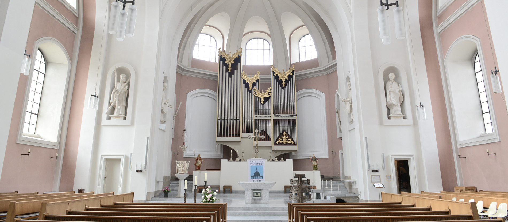

+++
date = '2025-07-27T19:51:07Z'
title = 'Ablauf'
+++

## Freitag, der 08. August 2025

### 12:00 Standesamtliche Trauung
- Im [Alten Rathaus](https://maps.app.goo.gl/9RNdvMD1wXj41wBY6) Hannover

---

## Samstag, der 09. August 2025

### 11:00 Traugottesdienst

- In der Basilika St. Clemens ([Platz a. d. Basilika 1, 30169 Hannover](https://maps.app.goo.gl/ogUSYTrJQepKqvmU9))
- Gedruckte Exemplare des Liederheftes wird es vor Ort geben
  - Ein [PDF](/kirchheft.pdf) steht auch zur Verfügung.

### 12:30 Sektempfang

Der Sektempfang sowie der Rest des Abends verläuft auf dem Haus der [AV Frisia](https://avfrisia.cv) im Kreis der engen Freunde und Familie.

- Das Haus ist in [10 Gehminuten von der Kirche](https://maps.app.goo.gl/ggfyPjax6Uay9WC9A) zu erreichen
- Mit belegten Brötchen als kleiner Snack :sandwich:
- Gefolgt von Ansprachen, Gesprächen und Programm

### 14:30 Kaffee & Kuchen

- Mit Anschneiden der Hochzeitstorte :cake:
- Gefolgt von weiteren Ansprachen, Gesprächen und Programm

### 17:30 Buffet

- Den Speiseplan [findest du hier](/food)

### 20:00 Musik & Tanz

- Liederwünsche? Dafür haben wir eine [Spotify Playlist!](https://open.spotify.com/playlist/2f8q54EvjJAfcSyiwawevs?si=4fdcff7c685b45b6&pt=8cd8bcc40878ef9cccd8e7a228bc9cd1)

### 00:00 Mitternachtssnack

- :rotating_light: Hotdogs :hotdog:

---
**Hinweis:** die Zeitangaben sind, mit Ausnahme der Trauung, flexibel und gegebenenfalls anpassbar :wink: Der Traugottesdienst sowie die Party am Abend sind für alle Freunde, Arbeitskollegen, Kommilitonen, Farben- und Bundesgeschwister öffentlich.
